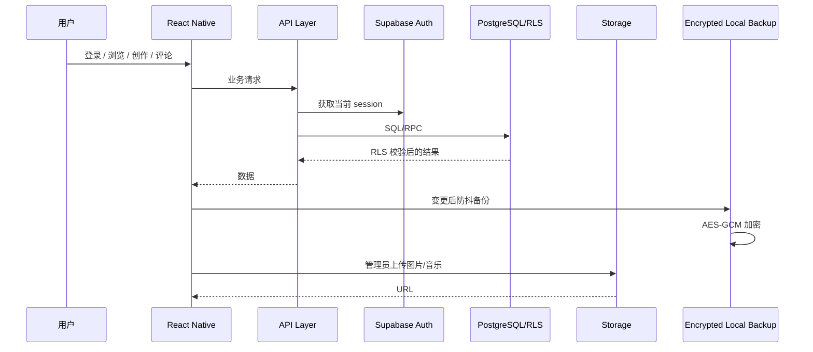
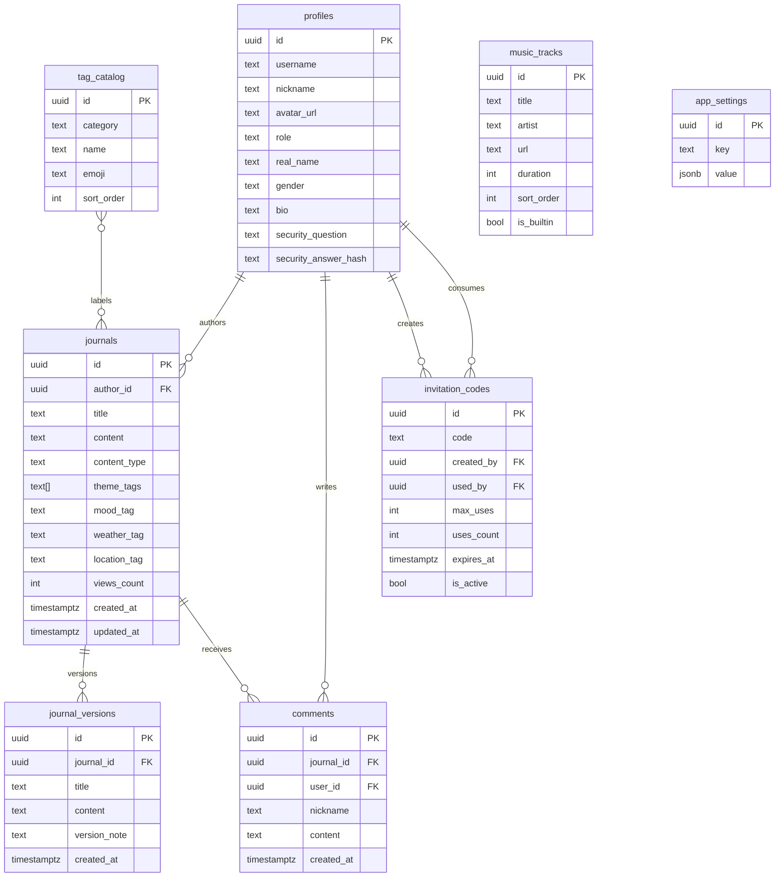
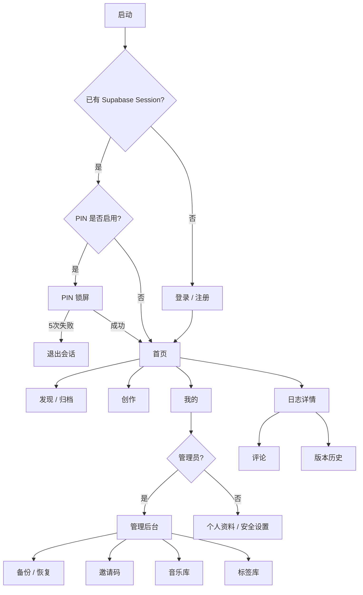

# MOSI V4 系统架构、ER 图与页面流程

> 基于 V3 源码的代码级升级结果。V4 以“个人哲学思辨日志 / 思想档案”为核心定位。

## 1. 总体系统架构

```mermaid
flowchart TB
  U[用户 / 管理员] --> RN[Expo + React Native / Web]
  RN --> UI[页面与 UI 组件]
  UI --> CTX[Session / Theme / Audio Context]
  CTX --> API[services/api.ts]
  API --> SB[Supabase Client]
  SB --> AUTH[Supabase Auth]
  SB --> DB[(PostgreSQL)]
  SB --> ST[(Supabase Storage)]
  RN --> LOCAL[AsyncStorage]
  RN --> SEC[SecureStore]
  LOCAL -. AES-GCM .- SEC
  DB --> RLS[RLS + public.is_admin()]
  ST --> SRLS[Storage Policies]
```

## 2. 分层架构

| 层 | V4 实现 | 责任 |
|---|---|---|
| 客户端 | Expo 55 / React Native 0.83 / Web | Android、iOS、Web UI |
| 路由 | Expo Router | 页面导航与参数 |
| 状态 | Session/Theme/Audio Context | 会话、主题、播放状态 |
| 业务 | `src/services/api.ts` | 日志、评论、标签、音乐、邀请码、Profile |
| 云后端 | Supabase | Auth、Postgres、Storage |
| 权限 | PostgreSQL RLS + RPC | 真正的安全边界 |
| 本地 | AsyncStorage | 加密备份载体、缓存 |
| 安全存储 | SecureStore | PIN、备份 AES key、生物识别开关 |

## 3. 数据流



## 4. 数据库 ER 图



## 5. 页面流程



## 6. 核心安全边界

1. **管理员身份**：数据库 `profiles.role = admin` + `public.is_admin()`。
2. **普通用户**：不能通过更新自己的 Profile 把 `role` 改成 admin。
3. **日志写权限**：只有管理员能写/改/删日志。
4. **评论**：公开读取；匿名/登录用户可写；删除限本人或管理员。
5. **邀请码**：表本身不再允许公开读取/更新；使用 security-definer RPC 校验和原子核销。
6. **文件上传**：管理员 + Storage policy + bucket MIME/大小限制三层约束。
7. **本地备份**：AES-GCM 加密，密钥存 SecureStore，不再把备份明文放入 AsyncStorage。
8. **生物识别**：仅作为本机解锁门槛，不再保存 Supabase 用户密码。
9. **PIN**：保存在 SecureStore，连续 5 次失败退出当前会话。

## 7. V3 主要问题 → V4 修复

| V3 问题 | 风险 | V4 修复 |
|---|---|---|
| `journals` 任意 authenticated 写/改/删 | 高 | admin-only RLS |
| `music_tracks` 任意 authenticated 写/改/删 | 高 | admin-only RLS |
| `tag_catalog` 全开放写 | 高 | admin-only RLS |
| `comments` 任意 authenticated 删除 | 中高 | owner/admin |
| `profiles` 可被用户自改 role | 严重 | trigger + admin helper |
| invitation_codes 公共读取/更新 | 严重 | RPC + admin-only table policy |
| profiles 公共 SELECT | 高 | owner/admin only |
| security_answer 明文 | 高 | SHA-256 hash，移除明文列 |
| view counter 读后写 | 中 | 原子 RPC |
| Storage 任何人可上传 | 高 | admin-only + bucket limits |
| 生物识别保存密码 | 严重 | 不再保存 Supabase password |
| 本地备份明文 | 高 | AES-GCM + SecureStore key |
| PIN 明文 AsyncStorage | 中高 | SecureStore |
| Expo Router 源码扁平化 | 构建风险 | 标准 `src/app` 结构 |

## 8. V4 功能完成度

- 账号 / Profile：**高**
- 日志 CRUD：**高（管理员写入）**
- Markdown / 图文 / 对话：**高**
- 搜索与多维筛选：**高**
- 版本历史：**中高**
- 评论：**高**
- 音乐伴读：**高**
- 标签后台：**高**
- 邀请码：**高（安全模型已重构）**
- 本地加密备份：**高**
- PIN / 生物识别：**中高**
- 安全问题“找回密码”完整闭环：**尚未完成**
- 真正的全文搜索索引：**尚未完成**
- 多设备冲突合并：**尚未完成**
- AI 思想关联 / 知识图谱：**V4 尚未实现**

## 9. 下一阶段建议

### V4.1 数据层
- 将 `theme_tags text[]` 正规化为 `journal_tags` 多对多表。
- 增加全文检索索引（PostgreSQL FTS / `pg_trgm`）。
- 增加 `audit_logs`。
- 为备份增加可选导出文件与版本号。

### V4.2 思想层
- 建立“概念 / 人物 / 观点 / 论证”实体。
- 从日志版本生成思想演化时间线。
- 建立 journal ↔ concept 图关系。

### V5 AI 层
- AI 摘要、概念抽取、矛盾检测。
- “2025 的我 vs 2026 的我”思想变化分析。
- 个人哲学知识图谱。
- 基于历史日志的语义检索与 RAG。
